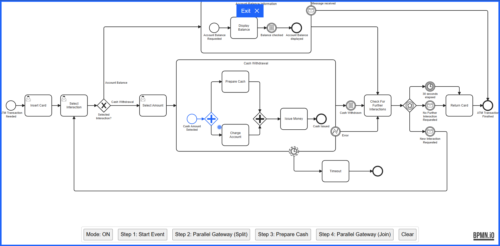

> Looking for the Camunda Modeler Plugin? Get it [here](https://github.com/philippfromme/bpmn-js-token-simulation-plugin)!

# bpmn-js Token Simulation

[](https://github.com/bpmn-io/bpmn-js-token-simulation/actions?query=workflow%3ACI)

A bpmn-js extension for token simulation. [__Try it out__](https://bpmn-io.github.io/bpmn-js-token-simulation).

[](https://bpmn-io.github.io/bpmn-js-token-simulation)


## Installation

Install via [npm](http://npmjs.com/).

```
npm install bpmn-js-token-simulation
```

Add as additional module to [bpmn-js](https://github.com/bpmn-io/bpmn-js).

### Modeler

```javascript
import BpmnModeler from 'bpmn-js/lib/Modeler';
import TokenSimulationModule from 'bpmn-js-token-simulation';

const modeler = new BpmnModeler({
  container: '#canvas',
  additionalModules: [
    TokenSimulationModule
  ]
});
```

### Viewer

```javascript
import BpmnViewer from 'bpmn-js/lib/NavigatedViewer';
import TokenSimulationModule from 'bpmn-js-token-simulation/lib/viewer';

const viewer = new BpmnViewer({
  container: '#canvas',
  additionalModules: [
    TokenSimulationModule
  ]
});
```


## Build and Run

Prepare the project by installing all dependencies:

```sh
npm install
```

Then, depending on your use-case you may run any of the following commands:

```sh
# build the library and run all tests
npm run all

# spin up the example
npm start

# run the full development setup
npm run dev
```


## Licence

MIT
