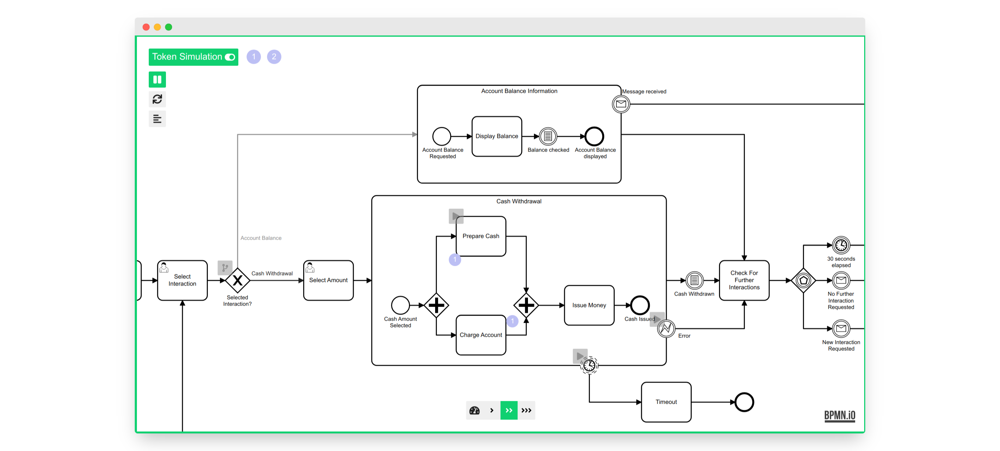

> Looking for the Camunda Modeler Plugin? Get it [here](https://github.com/philippfromme/bpmn-js-token-simulation-plugin)!

# bpmn-js Token Simulation

[](https://travis-ci.com/bpmn-io/bpmn-js-token-simulation)

A bpmn-js extension for token simulation.



## Installation

Install via [npm](http://npmjs.com/).

```
npm install bpmn-js-token-simulation
```

Add as additional module to [bpmn-js](https://github.com/bpmn-io/bpmn-js).

### Modeler

```javascript
var BpmnModeler = require('bpmn-js/lib/Modeler');
var tokenSimulation = require('bpmn-js-token-simulation');

var modeler = new BpmnModeler({
  container: '#canvas',
  additionalModules: [
    tokenSimulation
  ]
});
```

### Viewer

```javascript
var BpmnViewer = require('bpmn-js/lib/NavigatedViewer');
var tokenSimulation = require('bpmn-js-token-simulation/lib/viewer');

var viewer = new BpmnViewer({
  container: '#canvas',
  additionalModules: [
    tokenSimulation
  ]
});
```

## Example

Install dependencies.

```bash
npm install
```

Run example.

```bash
npm start
```

Check out `localhost:8080`.

## Supported Elements

* Boundary Event (attached to Subprocess)
* Call Activity
* End Event
* Event-based Gateway
* Exclusive Gateway
* Intermediate Catch Event
* Intermediate Throw Event
* Parallel Gateway
* Start Event
* Task
* Terminate End Event
* Subprocess

## Licence

MIT
