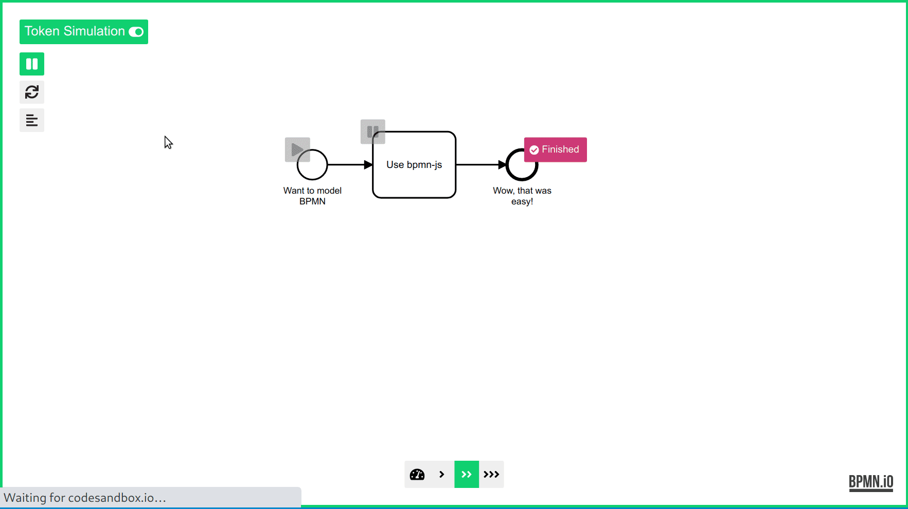

# Simulation Support / Scripting

Use the [`simulation-support` module](../../lib/simulation-support) to drive and introspect a [token simulation instance](https://github.com/bpmn-io/bpmn-js-token-simulation) via API.

[](https://codesandbox.io/s/amazing-christian-ry9yw)


## Features

* Record and assert the trace of execution
* Toggle pause and resume
* Await element enter and exit
* Trigger event / continue execution


## Usage

Driver and introspection capabilities are hooked up via the [`simulation-support` module](../../lib/simulation-support):

```javascript
import SimulationSupportModule from 'bpmn-js-token-simulation/lib/simulation-support';

const modeler = new BpmnModeler({
  additionalModules: [
    ...,
    SimulationSupportModule
  ]
});
```

The [`SimulationSupport`](../../lib/simulation-support/SimulationSupport.js) service exposed by the module provides all relevant APIs:

```javascript
const simulationSupport = modeler.get('simulationSupport');

// enable simulation
simulationSupport.toggleSimulation(true);

// toggle pause on activity
simulationSupport.triggerElement('UserTask_1');

// start simulation
simulationSupport.triggerElement('StartEvent_1');

await simulationSupport.elementEnter('UserTask_1');

window.alert('WANT ME TO CONTINUE?');

// trigger un-pause
simulationSupport.triggerElement('UserTask_1');
```
